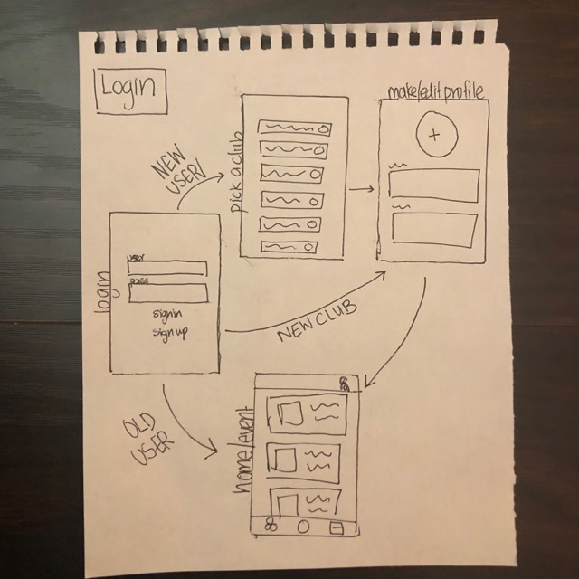
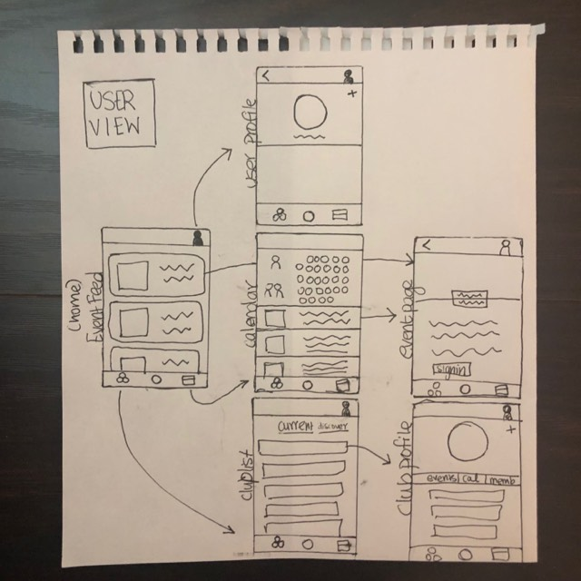
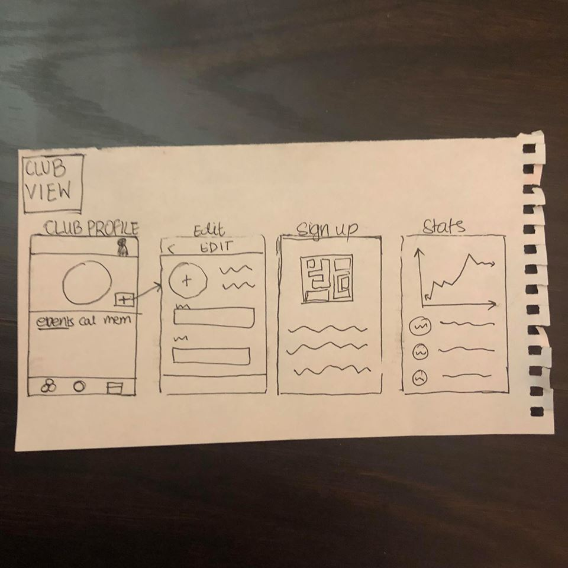

# ClubHub

## Authors
*Lindsey Gray*  
*Srivarshini Ananta*  
*Sravya Divakarla*  
*Cindy Hoang*

## Milestone 1
During this phase of development, we mapped out our apps navigation flow, prioritized the features we want to implement, and researched and tested server support solutions. Our application will be a platform for clubs to set up a profile, post events, and track membership. Users will be able to learn about existing and emerging clubs, follow clubs that interest them, and get details about upcoming events. 

### Design
<pre>

 

 

 
</pre>

### Libraries
* JTAppleCalendar - customizable calendar library 
   <https://github.com/patchthecode/JTAppleCalendar/>

* Firebase: Google SaaS 
  * Firebase/Core - base
  * Firebase/Firestore: storage
  * Firebase/Database: real time database/updates
  * FirebaseUI : auth UI
  * FirebaseUI/Auth : auth
  * FirebaseUI/Google : Google auth

### Server Support - Firebase
We plan on using Google Firebase for data storage and authentication. Firebase is free with great documentation and can be used with other platforms, such as Android, if the app is expanded. We will be storing data for user profiles, club profiles, and event details. Authentication will be done through Google using Firebases’ framework and UI tools.

### Models
* Club profile class
* User profile class 
* Event profile class 
* Calendar view class  

### View Controllers
* Login View Controller - Login with Google using Firebase 
* Pick Club(s) View Controller - Allow new users to pick clubs they want to follow
* Make/Edit Profile View Controller - Allow new users to create their profile
* Home View Controller - Display events and news based on subscribed clubs
* Clubs View Controller - Display listview of clubs you are part of and discover new ones
* Club Profile View Controller - Display profile for club user selected
* Calendar View Controller - Display calendar and list events for selected day 
* Event Details Page - Display details for an event
* Add/Edit Event View Controller  - Allow club admins to add new events or edit existing ones

Protocols and delegates will be used to pass event data, club data, and selection data between view controllers. We plan on navigating between view controllers using the parent/child method taught in class. 
    
### Trello
<https://trello.com/b/Kk6IVYPB/ecs-189e-the-xcoders>

### Testing Plan
In this phase of development, we plan on testing our concept by getting feedback from club leaders and members. We want to learn more about what users would like from the event as well as what the features that clubs would find beneficial. 
